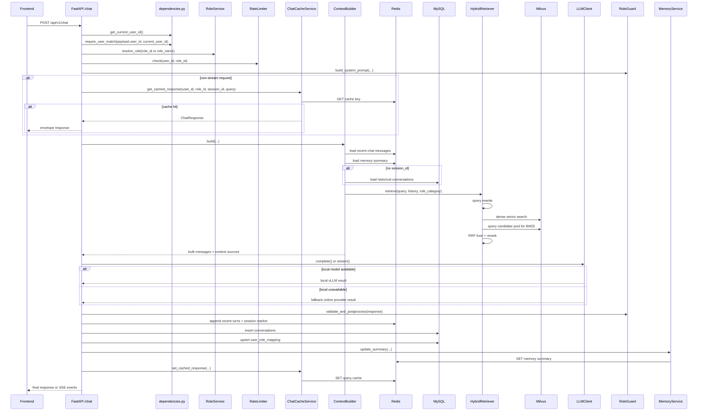
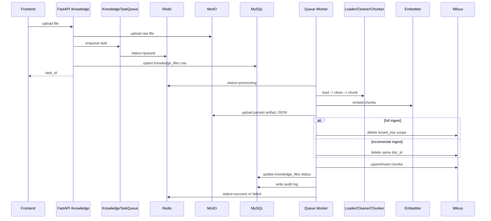

# Backend Chat Flow

## Scope

This note maps the current backend flow for:

- chat request handling
- session isolation and cache layout
- knowledge ingest background processing

It is based on the current implementation under `app/`.

## Main Chat Path

Entry point:

- `app/main.py`
- `app/api/routers/chat.py`
- `app/api/dependencies.py`

### Sequence Diagram

### Request Stages

1. `chat()` first validates user identity from bearer token or optional dev header, then enforces `payload.user_id == current_user_id` when auth is present.
2. `RoleService.resolve_role()` resolves preset/custom role by `role_id`, or creates an auto custom role when only a new `role_name` is provided.
3. `RedisLeakyBucketRateLimiter` rate-limits by `user_id + role_id`.
4. `RoleGuard.build_system_prompt()` merges role category policy with stored role prompt.
5. Non-stream requests try Redis query cache first. Cache is isolated by `user_id + role_id + session_id + sha256(query)`.
6. `ContextBuilder.build()` assembles:
   - recent rounds from Redis list
   - summary memory from Redis string
   - MySQL conversation history only when `session_id` is absent
   - retrieved RAG evidence from `HybridRetriever`
7. `HybridRetriever.retrieve()` runs:
   - query rewrite
   - dense vector search in Milvus
   - BM25 rerank over a Milvus candidate pool
   - RRF fusion
   - BGE reranker final ordering
8. `LLMClient` tries providers in order:
   - local `vllm`
   - online fallback `siliconflow`
9. `RoleGuard.validate_and_postprocess()` strips obvious role-break markers and appends category-specific disclaimer for lawyer/doctor/stock.
10. `_persist_chat()` writes:
    - Redis recent chat list
    - Redis session marker
    - MySQL `conversations`
    - MySQL `user_role_mapping`
11. `MemoryService.update_summary()` refreshes the Redis summary text for the same `session_id`.
12. `ChatCacheService.set_cached_response()` stores the final answer for non-stream reuse.

## Session Isolation

Current isolation is intentionally layered:

| Layer | Key / filter dimension | Notes |
| --- | --- | --- |
| Redis recent chat | `user_id + role_id + session_id` | `chat_recent_key()` |
| Redis session marker | `user_id + role_id + session_id` | `chat_session_key()` |
| Redis summary memory | `user_id + role_id + session_id` | `memory_summary_key()` |
| Redis query cache | `user_id + role_id + session_id + query hash` | `query_cache_key()` |
| MySQL conversations | `user_id + role_id` only | No `session_id` column yet |
| Milvus retrieval scope | `tenant_key = user_id:role_id` | plus optional `role_category` |

Important implication:

- Redis-based short memory and cache are already per-session.
- MySQL conversation history is still cross-session for the same `user_id + role_id`.
- `ContextBuilder` avoids mixing old MySQL history into active multi-session flows by skipping MySQL history loading when `session_id` exists.

## Streaming vs Non-Streaming

### Non-stream

- tries cache first
- calls `LLMClient.complete()`
- persists final response after completion
- writes summary and cache immediately before returning JSON

### Stream

- skips cache lookup
- emits SSE `start`
- emits SSE `source` for each retrieved evidence chunk
- forwards `delta` and `end` from provider stream
- only after stream finishes:
  - postprocess final buffer
  - persist chat
  - update summary
  - write query cache

## Retrieval Path

Main files:

- `app/retriever/query_rewrite.py`
- `app/retriever/hybrid.py`
- `app/retriever/reranker.py`
- `app/knowledge/embedder.py`

### Retrieval Details

1. Query rewrite is optional and controlled by config.
2. Dense retrieval embeds the rewritten query with the same BGE-M3 embedder family used for ingest.
3. Dense retrieval searches Milvus collection by `embedding`.
4. BM25 retrieval does not read from MySQL or local files directly; it queries a candidate pool from Milvus first, then scores those texts in memory.
5. Result fusion uses Reciprocal Rank Fusion.
6. Final rerank uses `FlagReranker`.

## Knowledge Ingest Path

Entry points:

- `app/api/routers/knowledge.py`
- `app/knowledge/task_queue.py`
- `app/knowledge/ingest.py`

### Sequence Diagram

### Ingest Notes

- Upload route first stores the raw file in MinIO, then enqueues the task, then upserts the MySQL `knowledge_files` record.
- Ingest status lives in Redis hash by `user_id + role_id + task_id`.
- Parsed intermediate artifact is uploaded to MinIO as JSON.
- Milvus payload stores `tenant_key`, `role_category`, `doc_id`, `chunk_id`, `text`, `embedding`, `source`.
- `mode=full` clears the tenant scope before insert.
- `mode=incremental` replaces only the same `doc_id`.

## Storage Responsibilities

### MySQL

- users
- preset roles / custom roles
- conversations
- user-role usage mapping
- knowledge file metadata
- audit logs

### Redis

- request-time memory
- summary memory
- query cache
- rate limit buckets
- knowledge ingest status

### Milvus

- knowledge chunks for retrieval
- tenant isolation mainly by `tenant_key`

### MinIO

- original uploaded files
- parsed ingest artifacts

## Known Operational Gotchas

1. Backend source code is not bind-mounted into the container; local Python edits do not automatically affect `rag-api`.
2. Restarting `rag-api` can also kill the local OpenAI-compatible model service listening on `127.0.0.1:8001` inside the container.
3. PowerShell sometimes shows Chinese mojibake even when the file itself is valid UTF-8.
4. `app/main.py` currently contains a large amount of educational commentary; it does not change behavior, but it makes the real bootstrap path harder to scan quickly.

## Suggested Next Steps

1. Add `session_id` to MySQL `conversations` if you want durable session-level replay and audit consistency.
2. Do a full regression pass for:
   - non-stream cache hit
   - stream persistence after SSE completion
   - clear-chat deletion for one session only
   - multi-session same role isolation
3. If we keep evolving this codebase, consider moving the oversized tutorial comments in `app/main.py` into a separate learning note.
